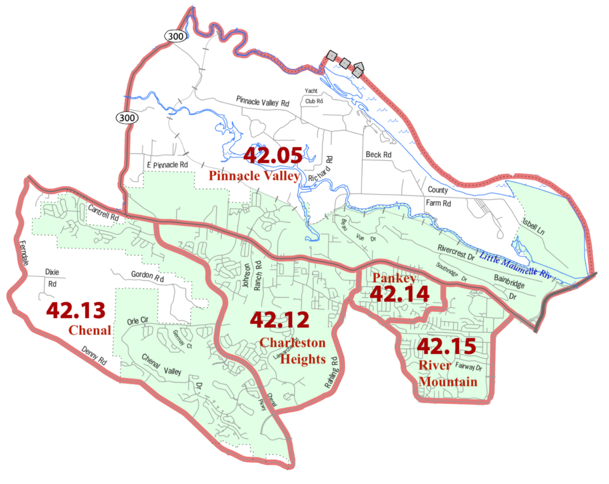

```{r setup, include = FALSE}
knitr::opts_chunk$set(echo = TRUE)
```

```{r, include=FALSE}
library(tidyverse)
library(tidycensus)

api_key<-"1c21eb7b81694c448307c9d6819b1a52b997258c"
```

# Introduction

The purpose of my project is to gain a better understanding of neighborhood-related trends in West Little Rock, Arkansas, and determine what long-term impacts a road-widening project along Highway 10 may have on the area. By developing a demographic profile along with population projections and forecasts, I will examine historic, current, and expected future neighborhood trends in West Little Rock. I am particularly interested in analyzing the road-widening project because it is happening in the place where I grew up. Having first-hand knowledge of the place, I am aware that the project will have unmitigated impacts on a historic African American neighborhood, and that the Arkansas Department of Transportation (ARDOT) has done little to consider how the project may shape the composition of surrounding neighborhoods.

```{r 3_FactFinder, echo=FALSE, fig.caption="Highway 10 Project Study Area", fig_width='50%'}

```

ARDOT held several public meetings for the project, though they were primarily informative. The state transportation department does not have any guidance on how to engage with communities outside of NEPA – which requires them to provide opportunities for public participation, typically after the project has already started and alternatives have been developed. This has led to an approach to transportation planning in which communities are unable to meaningfully participate in the decision-making process. Other states, such as Illinois, have developed more guidance for considering community impacts related to proposed transportation projects. Such community impact assessments require the collection of qualitative data through questionnaires that are distributed to the public. Factors considered in those surveys, such as visual impacts, air pollution, safety, and property acquisition, are difficult to measure with the tools that we have been introduced to this semester in Neighborhood Analysis.

Since I am familiar with the project and some of the potential qualitative impacts, I wanted to use this project as an opportunity to apply some of the skills that I have acquired this semester and look at what stories quantitative data can tell. So, in this project I will be developing a demographic profile of West Little Rock, with specific emphasis on the neighborhood of Pankey, using ACS and decennial census data; as well as developing population projections and forecasts to determine how exactly West Little Rock is expected to change, and see if my findings are aligned with those made by other local and regional planners.

# Background

### Highway Project Description

In 2016, the Arkansas Department of Transportation announced a project targeted at widening an 8.3-mile segment of Highway 10, an arterial road in West Little Rock. According to ARDOT, Highway 10 is one of the most heavily congested roadways in the state. The benefit-cost analysis for the project shows that widening the road will alleviate traffic along Highway 10 through 2035, at which point the road will become congested and need to be widened again. Still, the benefits of the project include a short-term reduction in congestion, improved safety for automobile drivers, and a reduction in vehicular emissions associated with idling. Another benefit is improved access to Pinnacle Mountain, a state park which draws thousands of tourists annually, through vehicular traffic alleviation and the expansion of existing bike trail networks.

In the process of working on this project, the ARDOT website was redesigned and links to reports and other documents associated with the initial planning stages of this project were removed. So, it has been difficult to track what all ARDOT has accomplished thus far and what stage they are at now by relying solely on internet sources. From talking with relatives and friends who still live in the area, I learned that construction has already started, and that the road has been closed for extended periods of time, making other routes congested as a result. Since the project is happening in phases, these street closures will be ongoing for at least five years.

### West Little Rock

West Little Rock is a section of the City of Little Rock that encompasses at least a dozen neighborhoods. The area saw a boom in development in the 1980s and 1990s during Bill Clintons gubernatorial and presidential terms, and during the early 2000s before the recession. West Little Rock is in the midst of another development boom today, with the creation and expansion of residential and transit infrastructure. 

Highway 10 is one of four major arterial east/west roads in West Little Rock which is heavily traveled by people who commute downtown, and experiences routine congestion. Highway 10 is a bit unique because it is interchangeably referred to as Highway 10 and Cantrell Road. The intersection at Interstate-430 is often where the distinction is made between the two, with everything to the west being considered Highway 10 and everything to the east being Cantrell Road. Nevertheless, there are signs all along Highway 10 that identify the road as Cantrell. The two names seem to have different connotations, with Cantrell invoking feelings of residential space and Highway 10 invoking feelings of commercial space. While it faces just as much congestion as Highway 10, Cantrell has remained a five lane road for years. Proposals have been made to expand that road as well, though residents along Cantrell have been more vocally opposed to them. They tend to be most concerned about the safety and economic implications of such a project as the Cantrell area is older and more established. Since Highway 10 has more new development with commercial buildings set further back from the road, it has received less criticism.

```{r}



```

For the sake of this report, I will be looking at five neighborhoods as defined by 2010 census tracts: Pinnacle Valley, Charleston Heights, River Mountain, Chenal, and Pankey. Each tract encompasses several small, distinct neighborhoods with unique demographic characteristics. For the sake of utilizing ACS and decennial census data, I have decided to define neighborhoods at the tract level and will provide insight into potential variations within the tracts as needed.


### Pankey

Pankey is a small neighborhood in West Little Rock centered along Highway 10 between Sam Peck and Taylor Loop Road. It is a historic neighborhood that was founded over a century ago by Josephine Pankey – a teacher, philanthropist, and community leader. Josephine Pankey purchased land to establish the community for African American residents in 1907, at a time when the area was undeveloped and about five miles west of the city limits. Highway 10 was eventually paved as a two-lane road in the 1930s, and Pankey was annexed into Little Rock in the 1960s. For a number of reasons, the neighborhood’s population started to decline in the 1970s and Highway 10 was widened from two lanes to four in the 1980s. This initial widening separated the community geographically since the neighborhood is anchored by Highway 10 with residences and public buildings on either side of the road. Since Pankey is the neighborhood that is most likely to be directly impacted by the Highway 10 widening project, I will highlight it often throughout my analysis.

The formal boundaries of Pankey are divided between the census tracts of Pankey and Pinnacle Valley. The census tract "Pankey" includes other middle class and upper-middle class neighborhoods which have different physical and demographic characteristics.

# Methods and Approach

The goal of my project is to understand neighborhood change in West Little Rock. My approach for tackling this is to develop a demographic profile along with population projections and forecasts. I initially considered developing opportunity indices and maps, but since the highway project has implications for growth and change over time, I thought that looking at population change and existing demographic factors would be the best approach for my project.

For this project, I will be utilizing what I learned from the Session 9 and 11 labs and various readings, along with online sources for guidance on mapping census data. I will also be referencing existing neighborhood change forecasts and weaving in my own qualitative analysis.

# Data Sources

I will be using 2000 and 2010 decennial census data and 2019 American Community Survey (ACS) data for this project. Other sources of information include existing regional and local plans.

# Demographic Profile

Understanding neighborhood change is a complex task that requires comparing trends within and across various places and scales. To understand how the Highway 10 road-widening project will impact surrounding neighborhoods, it's important to look not only at those neighborhoods that will be directly impacted, but at adjacent neighborhoods as well as the entire city, county, state, and country. It's likely that the road-widening project will have impacts beyond the project area, influencing where future growth and investment will take place, prioritizing West Little Rock over other parts of the city.

In order to develop a demographic profile for this project, I decided to utilize 2010 decennial census data and ACS data to look at different variables related to the socioeconomic conditions of neighborhoods in Little Rock, especially the five census tracts in my study area. Though the 2010 numbers are slightly dated, decennial data offers more detailed information at the block group scale - something that I could not find in ACS data.

### Population

```{r}
little_pop <- get_acs(state = "AR", county = "Pulaski", year = 2019, geography = "tract", variables = "B01001_001", geometry = TRUE)

little_pop %>% ggplot(aes(fill = estimate)) + geom_sf(color = NA) + scale_fill_viridis_c(option = "D", direction = -1)
```

Above is a map that shows the population distribution for Pulaski County, Arkansas, as estimated for 2019. From this map, it's apparent that the fastest growing places in the county are those outside of the city limits, particularly towards Benton and Bryant to the southwest and Maumelle to the northwest. Within the five tract study area, Charleston Heights is the most populated with 6,800 residents, followed by River Mountain with 5,500, then Chenal with 4,600, then Pinnacle Valley with 4,200, and lastly Pankey with 2,900. 

### Race

```{r}
race <- c(White = "P005003", Black = "P005004")

little_race <- get_decennial(geography = "block", variables = race, state = "AR", county = "Pulaski County", year = "2010", geometry = TRUE, summary_var = "P001001") 

little_race %>%
  mutate(pct = 100 * (value / summary_value)) %>%
  ggplot(aes(fill = pct)) +
  facet_wrap(~variable) +
  geom_sf(color = NA) +
  scale_fill_viridis_c(direction = -1)
```
The two maps above show the racial composition of Pulaski County by percentage and census block group. The data is from the 2010 decennial census, since it is difficult to make estimates for ACS data at the block group level for more recent years. As visible on the two maps above, block groups with a higher percentage of Black residents tend to be closer to downtown Little Rock and concentrated on the south and east sides of town. Block groups with a higher percentage of white residents tend to be more heavily concentrated on the north and west side of Little Rock, as well as outside of the city's boundaries. I excluded maps of the Hispanic/Latino and Asian populations because they were not heavily concentrated or in visible patterns. There is a Latino neighborhood emerging in Southwest Little Rock, often referred to as "Little Mexico," but it is a distance away from the study area and not well represented in the 2010 data.

West Little Rock has a visibly high concentration of white residents. Directly along Highway 10 there seems to be a slightly smaller concentration, with more minorities living in those neighborhoods. Based on data from the 2019 ACS 5-year estimates, Chenal and Charleston Heights are the two tracts in the study area with the highest percent white population and the lowest minority population. Pinnacle Valley and River Mountain have the highest percent Black population in the study area, with the lowest percent of Asian and Hispanic/Latino residents. Pankey has the highest percent Asian and Hispanic/Latino population in the study area, with about average white and Black populations.

### Income
```{r}
little_income <- get_acs(geography = "tract", variables = "B19013_001", state = "AR", county = "Pulaski", geometry = TRUE)

little_income %>% ggplot(aes(fill = estimate)) + geom_sf(color = NA) + scale_fill_viridis_c(option = "D", direction = -1)
```
The map above shows the average annual income for residents in Pulaski County by census tract, as reported in 2019 ACS estimates. This map shows that the highest incomes are concentrated in West Little Rock and in the Heights and Hillcrest neighborhoods on the north side of the city. The highest incomes are visibly concentrated in Chenal. Charleston Heights and Pankey having slightly higher than average incomes in the study area, with Pinnacle Valley having the lowest. More broadly, it's clear that the tracts in the study area have more wealth than other parts of the city, especially those on the south and east sides.

# Population Projections

```{r, include = FALSE}
little_pop_2019 <- get_acs("place", state = "AR", table = "B01001", year = 2019, survey = "acs1")

little_pop_2019 <- little_pop_2019 %>% filter(NAME == "Little Rock city, Arkansas") %>% mutate(variable = str_replace(variable, "B01001_0", "")) %>% filter(!variable %in% c("01", "02", "26"))

little_pop_2019 <-little_pop_2019 %>% 
  mutate(variable_cat = case_when(
    variable %in% c("03", "27") ~ "Under 5", 
    variable %in% c("04", "28") ~ "5 to 9", 
    variable %in% c("05", "29") ~ "10 to 14",
    variable %in% c("06", "30") ~ "15 to 19",
    variable %in% c("07", "31") ~ "15 to 19",
    variable %in% c("08", "32") ~ "20 to 24",
    variable %in% c("09", "33") ~ "20 to 24",
    variable %in% c("10", "34") ~ "20 to 24",
    variable %in% c("11", "35") ~ "25 to 29",
    variable %in% c("12", "36") ~ "30 to 34",
    variable %in% c("13", "37") ~ "35 to 39",
    variable %in% c("14", "38") ~ "40 to 44",
    variable %in% c("15", "39") ~ "45 to 49",
    variable %in% c("16", "40") ~ "50 to 54",
    variable %in% c("17", "41") ~ "55 to 59",
    variable %in% c("18", "42") ~ "60 to 64",
    variable %in% c("19", "43") ~ "60 to 64",
    variable %in% c("20", "44") ~ "65 to 69",
    variable %in% c("21", "45") ~ "65 to 69",
    variable %in% c("22", "46") ~ "70 to 74",
    variable %in% c("23", "47") ~ "75 to 79",
    variable %in% c("24", "48") ~ "80 to 84",
    variable %in% c("25", "49") ~ "85 or Older")) 

little_pop_2019 <-little_pop_2019 %>% 
  mutate(sex_cat = case_when(
    variable %in% c("03", "04", "05", "06", "07", "08", "09", "10", "11", "12", "13", "14", "15", "16", "17", "18", "19", "20", "21", "22", "23", "24", "25") ~ "Male", 
    variable %in% c("27", "28", "29", "30", "31", "32", "33", "34", "35", "36", "37", "38", "39", "40", "41", "42", "43", "44", "45", "46", "47", "48", "49") ~ "Female"))

little_pop_2019 <-little_pop_2019 %>% 
  group_by(variable_cat, sex_cat) %>% 
  summarise(Pop = sum(estimate))

little_pop_2019 <- little_pop_2019 %>% pivot_wider(names_from = sex_cat, values_from = Pop)

little_pop_2019 %>% select(variable_cat, Male, Female)
```
### Existing Projections

```{r, echo = FALSE, out.width = "50%", out.height = "50%", fig.cap = "population pyramid"}


```
Above is a population pyramid for the City of Little Rock, based on 2019 ACS data. It suggests that the city has a population that is aging, though millennials seem to be the largest age group. Central Arkansas's regional planning agency, Metroplan, states in their [long range plan](https://metroplan.org/wp-content/uploads/2021/01/CentralArkansas2050.pdf) that the region is expecting to see significant shifts in demographics soon, with an aging baby boomer population and larger millennial population, each seeking unique housing and lifestyle options that are at odds with the region's current infrastructure. The projection that they provide appears to be a linear curve projection since it is a straight line. Their projection estimates that the region will gain about 200,000 new residents by 2050 - up from its current total of 700,000. Little Rock's municipal planning agency appears to focus on current planning and does not have any long-range plans or population projections that are specific to the city.

One of the primary goals of Metroplan's regional plan for Central Arkansas is developing quality transportation corridors with more choices for pedestrians and bicyclists. Throughout the plan, its mentioned that the expansion of transit services beyond those designed for vehicles will improve access to opportunity and make the region more attractive/competitive. From my perspective, the Highway 10 expansion project defies the goals outlined in the regional plan, as it will facilitate sprawl and make the road harder to navigate for pedestrians. Adding a bike lane adjacent to the road, as recommended in the project proposal, will primarily benefit those biking for recreational purposes between Pinnacle Mountain State Park and the city's existing bike trail network along the Arkansas River. Since many of the people who live in West Little Rock go to work and school downtown, it is unlikely that they will be able to commute via trails for pedestrian or cyclist.

### Proposed Projections

```{r, include = FALSE}
little_pop_2010 <- get_decennial(geography = "tract", variable = "P001001", state = "AR", county = "Pulaski County", year = "2010", geometry = TRUE) 

little_pop_2000 <- get_decennial(geography = "tract", variable = "P001001", state = "AR", county = "Pulaski County", year = "2000", geometry = TRUE) 

```

```{r, echo = FALSE, out.width = "50%", out.height = "50%", fig.cap = "population pyramid"}

```
Above are the population projections that I produced for the five tracts within the study area. I developed them with the "trend projection" Excel workbook provided in Session 11, using total population data. In the workbook, I input data from the 2000 and 2010 census. I also used 2019 ACS 5-year estimates as a substitute for 2020 census data. More accurate projections could be made when tract-level data from the 2020 census is released.

These charts tell a compelling story about how growth is happening in West Little Rock. Chenal and Charleston Heights are expected to grow at much faster rates than the rest of West Little Rock. Pinnacle Valley is expected to grow at a moderate pace, while River Mountain and Pankey are expected to stagnate. In most cases, I would say that the linear and gompertz projections are the most accurate, though the parabolic projections seem more accurate in the tracts that are growing more slowly.

# Forecast

Central Arkansas's regional planning authority estimated in their 2050 long-range plan that the region will grow by more than 30% in the next thirty years. Their estimate is based on a linear population projection - the city grew by 15% between 2000 and 2015, so they expect it to grow at the same rate in the future. Still, Little Rock is growing at a much slower pace than other parts of the state, specifically Northwest Arkansas. Last year, Northwest Arkansas had a total net migration of 6,000 residents, while the Little Rock metro only had 150. The Little Rock area has not experienced much growth, in terms of jobs and development, when compared to Northwest Arkansas. While Little Rock is the largest metropolitan area in the state, Northwest Arkansas is expected to outgrow Central Arkansas by 2030. So, as Northwest Arkansas continues to grow, it seems more realistic that growth in Little Rock will stagnate by 2050. Also, when looking at regional data, there is growth happening in neighboring cities and counties which could suggest that many residents of Little Rock are moving to those places.

Still, growth will continue to happen in some parts of Little Rock. When examining the five census tracts that comprise the study area for the Highway 10 road widening project, it became apparent that even within West Little Rock, growth will likely occur in some parts and not others. Chenal will likely continue to experience the most growth and new development, as it is the fastest growing tract in the city with the wealthiest residents. Charleston Heights and Pinnacle Valley will follow a similar trend as they continues to develop, while Pankey and River Mountain will likely not experience much new growth at all. All of the tracts primarily contain suburban, residential neighborhoods. From my perspective, the difference between growth in the tracts hinges on when they were first developed. West Little Rock is an area that is defined by sprawl, so since Pankey and River Mountain were fully developed between the 1980s and 2000s, it makes sense that they would not experience much new growth. 

Since there are no incentives for the city to limit sprawl and encourage density, it is likely that the properties, infrastructure, and people in Pankey and River Mountain will continue to age. The widening of Highway 10 might encourage new commercial development along the roadway, but it will likely have few physical impacts on residential areas. Nevertheless, the widening of Highway 10 could negatively affect property values in those tracts, which could push current residents to newer neighborhoods in Chenal or Charleston Heights, further exacerbating sprawl. The neighborhood of Pankey will undeniably be impacted by the Highway 10 road widening project. As a low-density, not-fully-developed residential neighborhood situated along Highway 10, the city has placed pressure on residents of the neighborhood to move elsewhere. This is because the neighborhood will no longer be aligned with the land use vision for the area once the road is widened. As is, the Pankey neighborhood is physically divided by Highway 10. With a speed limit of 45 and limited vision around the bend where the neighborhood is situated, it's unsafe for residents of Pankey to travel from one side of the neighborhood to the other. Widening the road will undoubtedly make travel less safe for residents of Pankey and expose them to more traffic noise and visual impacts. Also, residents whose homes were directly adjacent to the roadway have already had to sell their property and move elsewhere. So, while this project may be facilitating overall growth in West Little Rock and alleviating congestion in the short-run, it will also be breaking apart long-standing communities like those in Pankey and encouraging sprawl that will negatively impact existing neighborhoods. 

The table below shows the percent change in occupied housing units for each tract in West Little Rock. This supports the argument that Pankey and River Mountain are experiencing minimal growth when compared to the other tracts in West Little Rock.

#### Change in Occupied Housing Units
|   | 2000 | 2010 | % Change |
|---|---|---|---|
| Pankey | 1,127 | 1,182 | 4.9% |
| River Mountain | 2,196 | 2,228 | 1.5% |
| Pinnacle Valley | 889 | 1,682 | 89.2% |
| Charleston Heights | 1,091 | 1,957 | 79.4% |
| Chenal | 538 | 1,317 | 144.8% |

Chenal is by far the tract that has experienced the most new development. Pinnacle Valley likely shows a higher percent change in occupied housing units since it is a larger tract that contains more undeveloped land. Some residents and politicians in the city have pushed back against the growth in far West Little Rock, because it has led to greater segregation both racially and economically, and degradation of service provisions in other parts of the city. So, essentially, the rest of the city is expected to suffer as a result of increased sprawl. One major concern associated with growth in Chenal and Charleston Heights is education. There are no public middle or high schools in West Little Rock, so many families send their children to private and charter schools. The city has also put more funding into elementary schools in West Little Rock which has led to the closure and/or consolidation of schools in other parts of the city. The expansion of Highway 10 and the encouragement of new growth in far West Little Rock will undoubtedly put pressure on the city to develop middle and high schools in that part of town. In turn, funding will be reduced for schools in other parts of Little Rock which will inevitably diminish the possibility for equitable access to opportunity.

# Conclusion

Widening Highway 10 will facilitate growth and alleviate traffic congestion in parts of West Little Rock. As stated in ARDOT's project proposal, the direct benefits of the project include increased connectivity, improved safety for drivers, and reduced air pollution from with idling. After examining the demographic profile for the county and developing population projections and forecasts for both the city and West Little Rock, it's clear that the project will also have negative impacts. One of the main downsides of the road-widening project is that it will further facilitate sprawl. In the long-run, this will lead to more pollution, inequity, and vehicle-dependency. With regard to the Pankey neighborhood, widening Highway 10 has already displaced residents and will ultimately break apart the community.

While the project has already been approved and entered the construction phase, the outcomes of widening Highway 10 should serve as an educational opportunity for ARDOT and Little Rock's city planners to consider what impacts new development may have on all residents. There should be greater accountability with regard to both direct-community and city-wide impacts. The city should also consider making density a higher priority in order to discourage sprawl and segregation.

While this project provides a brief overview of growth trends in West Little Rock, there are several opportunities to expand this research. One way to continue would be to collect more qualitative data directly from residents either through surveys or interviews. There appear to be a variety of values and needs regarding housing and transit, so understanding what those needs are and how widening Highway 10 will either support or oppose those would be valuable. Also, examining other factors related to housing, education, and jobs in more detail and developing opportunity projections would be useful.

